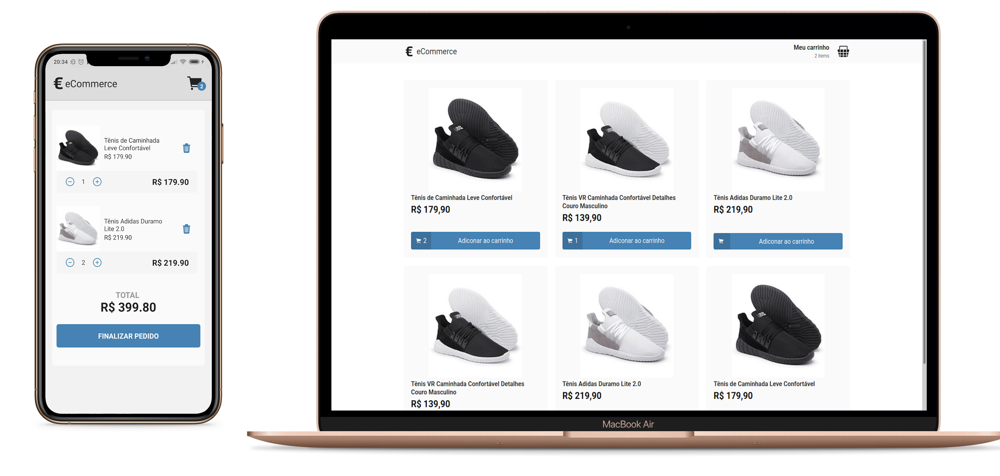

# € eCommerce

[WEB](#web) and [MOBILE](#mobile) application with a [fake REST-API](#fake-server).

<br><br>

<br>

## FAKE SERVER

### Technologies

- [Json-server](https://github.com/typicode/json-server)

## WEB

### Technologies

- [React](https://reactjs.org/)
- [Redux](https://redux.js.org/)
- [TypeScript](https://www.typescriptlang.org/)
- [React Router DOM](https://github.com/ReactTraining/react-router/tree/master/packages/react-router-dom)
- [Styled Components](https://styled-components.com/)
- [Axios](https://github.com/axios/axios)

<br/>

<p align="center">
  
</p>

<br/>

## MOBILE

### Technologies

- [React Native](https://reactnative.dev/)
- [Redux](https://redux.js.org/)
- [TypeScript](https://www.typescriptlang.org/)
- [React Navigation](https://reactnavigation.org/)
- [Vector Icons](https://github.com/oblador/react-native-vector-icons)
- [Styled Components](https://styled-components.com/)
- [Axios](https://github.com/axios/axios)

<br/>

<p align="center">
  
</p>

<br/>

## GETTING STARTED
### Requirements

- [Node.js](https://nodejs.org/)
- [Yarn](https://yarnpkg.com/) or [npm](https://www.npmjs.com/)
- [git](https://git-scm.com/)
- [React Native development environment](https://reactnative.dev/docs/environment-setup)

#### Clone the project and access the folder

```shell
$ git clone https://github.com/danielmesquitta/ecommerce && cd ecommerce
```

### Start backend

```shell
# Go to the correct folder
$ cd server

# Open package.json with your code editor.
$ code package.json
```

<br/>

Now, you will need to update the start script host according to your wifi ip: <br/> 
```"start": "json-server --host <YOUR_WIFI_IP> server.json -p 3333"``` <br/> <br/>

After this, you can go back to the terminal, still in the server folder and do the following:

```shell
# Install the dependencies
$ yarn

# Start
$ yarn start
```

### Start web

```shell
# Go to the correct folder
$ cd web

# Open api.ts with your code editor
$ code src/services/api.ts
```

Update the server wifi ip.
```baseURL: 'http://<YOUR_WIFI_IP>:3333'```


```shell
# Install the dependencies
$ yarn

# Start
$ yarn start
```

### Start mobile

```shell
# Go to the correct folder
$ cd mobile

# Open api.ts with your code editor
$ code src/services/api.ts
```

Update the server wifi ip.
```baseURL: 'http://<YOUR_WIFI_IP>:3333'```

```shell
# Install the dependencies
$ yarn

# Start
$ yarn android

# If it doesn't start automaticaly, just run the following and reopen the app
$ yarn start
```

The last step is to connect the app with the server. 
Open the react native developer menu on your emulator/phone, click on <b>Settings</b>, than <b>Debug server host & port for device</b> and type your wifi ip according to the following: ```<YOUR_WIFI_IP>:8081```

Now You can confirm and reload the app
